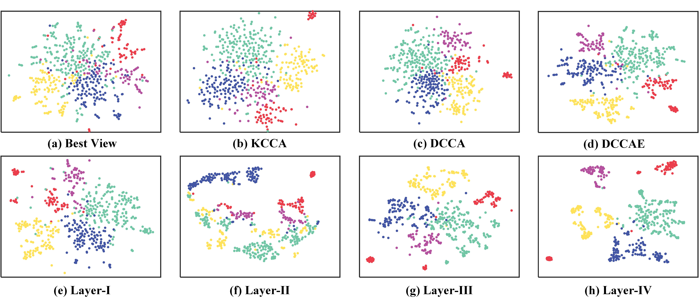

# Reciprocal Multi-Layer Subspace Learning for Multi-View Clustering
This is the Matlab implementation of Reciprocal Multi-Layer Subspace Learning for Multi-View Clustering, published in ICCV 2019. [website](http://openaccess.thecvf.com/content_ICCV_2019/papers/Li_Reciprocal_Multi-Layer_Subspace_Learning_for_Multi-View_Clustering_ICCV_2019_paper.pdf) 
Contact: Ruihuang Li (liruihuang@tju.edu.cn)

## Paper
* We propose a method to hierarchically identify the underlying cluster structure of high-dimensional data by constructing reciprocal multi-layer subspace representations.
* Based on reconstruction, we learn the latent representation by enforcing it to be close to different view-specific subspace representations, which implicitly co-regularizes subspace structures of all views to be consistent to each other.
* With the introduction of neural networks, more general relationships among different views will be explored.

## Example Results

